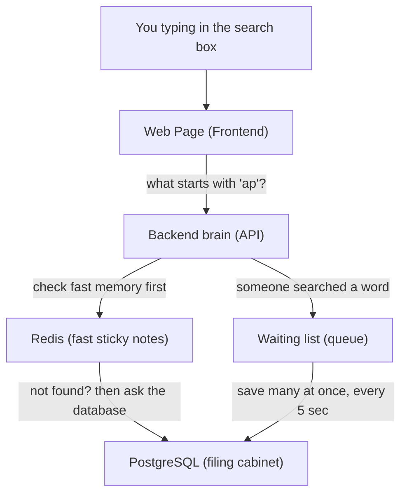

# Project Report — Typeahead Search (Beginner-Friendly Version)

**What is this project?** You know how Google shows suggestions the moment you start typing in the search box? This project builds that feature from scratch. As you type "ap", it instantly suggests "apple", "application", "amazon", and so on — ranked by how popular each word is. It also keeps track of what people search for, shows "trending" words, and is built to stay fast even when thousands of people use it at once.

This report explains how it works in plain language.

### What it looks like

Here's the app in action — as you type "hi", it instantly shows matching words ranked by popularity (the number on the right is how often each word is used):


---

## 1. Architecture (How the pieces fit together)

Think of the system as a small team, where each member has one job:

- **The Frontend** is the web page you see and type into (built with React).
- **The Backend** is the brain that answers questions like "what words start with 'ap'?" (built with Node.js + Express).
- **PostgreSQL** is the permanent filing cabinet — the database where every word and its popularity count is safely stored.
- **Redis** is a super-fast sticky-note board — a temporary memory that remembers recent answers so we don't have to open the filing cabinet every single time.

### How they talk to each other



**The two main journeys:**

1. **Reading (getting suggestions):** When you type, the backend first checks Redis (fast memory). If the answer is there, it's returned instantly. If not, it asks PostgreSQL, then saves a copy in Redis so next time is fast. This "check the fast memory first" idea is called **caching**.

2. **Writing (recording a search):** When you actually search for something, instead of writing to the database immediately (slow), we drop the word onto a **waiting list**. Every 5 seconds, the backend saves the whole list to the database in one go. This is like doing all your dishes at once instead of washing each plate the second you use it.

---

## 2. The Dataset (Where the words come from)

We didn't invent fake words. We used a real, free list made by a famous computer scientist, **Peter Norvig**:

- **Source:** https://norvig.com/ngrams/count_1w.txt
- It contains the **most common English words** along with how often each one really appears on the internet (based on Google's data).
- We loaded the **top 100,000 words**.

Because some words appear *billions* of times (a number too big for a normal counter), we store the counts in a special big-number format called `BigInt`.

**How to load it:** You don't have to do anything manually. When you start the project with Docker, it automatically downloads the word list and fills the database. (If you ever want to reload it by hand: `cd Backend` then `npx prisma db seed`.)

---

## 3. API Documentation (The buttons the backend offers)

An "API" is just a list of web addresses the backend understands. Here are the main ones (the backend runs at `http://localhost:8000`):

| What you call | What it does |
|---------------|--------------|
| `GET /api/v1/suggest?q=ap` | Get suggestions for "ap" — straight from the database (slower) |
| `GET /api/v2/suggest?q=ap` | Get suggestions for "ap" — using fast Redis memory (faster) |
| `POST /api/v1/search` | Tell the system "someone searched this word" |
| `GET /api/v2/trending` | Get the current trending words |
| `GET /api/v2/cache/debug?prefix=ap` | A debug tool: shows which Redis note-board holds "ap" and whether it's remembered |

**Example — asking for suggestions:**

```bash
curl "http://localhost:8000/api/v2/suggest?q=app"
```
You get back a list, with the most popular word first:
```json
{
  "message": "cache hit (v2)",
  "data": [
    { "query": "apple", "count": 12936192 },
    { "query": "application", "count": 9043121 }
  ]
}
```

**Example — recording a search:**
```bash
curl -X POST http://localhost:8000/api/v1/search \
  -H "Content-Type: application/json" \
  -d '{"query":"apple"}'
```
```json
{ "message": "Searched", "data": { "success": true, "queued": true } }
```
("queued: true" means it was added to the waiting list and will be saved soon.)

---

## 4. Design Choices (Why we built it this way)

Every choice below is a balance — we gained something and gave up something. Here they are in simple terms:

**1. We keep answers in fast memory (caching).**
- *Why:* Reading from Redis is much faster than the database.
- *The catch:* An answer can be up to 60 seconds old before it refreshes. For search suggestions, being slightly behind is totally fine.

**2. We spread the cache across 3 Redis servers (consistent hashing).**
- *Why:* One memory server could get overwhelmed. Splitting the load across three keeps things fast and lets us add more servers later.
- *How it decides which server holds a word:* a tidy math trick called **consistent hashing**, so that if we add a 4th server, only about a quarter of the words need to move (instead of all of them).
- *The catch:* It's a bit more complex to manage, and if one server goes down, its share of notes is lost — but that's okay, because the database can rebuild them.

**3. We save searches in batches, not one-by-one (write-behind batching).**
- *Why:* Writing to the database for every single search would overwhelm it. Saving a big batch every 5 seconds is far more efficient.
- *The catch:* If the server crashes, we might lose the last ~5 seconds of searches. For a "trending words" feature, that's an acceptable risk.

**4. Trending words use both popularity AND freshness (a blended score).**
- *Why:* If we only counted all-time popularity, the same old words would trend forever and nothing new could rise. If we only counted recent searches, random one-off words would dominate. So we mix both.
- *The catch:* The exact recipe uses a hand-tuned number to balance "old and popular" vs. "new and rising."

---

## 5. Performance Report (How fast is it, really?)

We stress-tested the system by hammering it with **100 users at the same time for 15 seconds** and measured the results.

| Test | What we measured | Requests handled | Speed | Average wait |
|------|------------------|------------------|-------|--------------|
| Recording searches | Write speed | 104,532 | ~6,969 per second | 237 ms |
| Suggestions **without** cache | Database only | 9,280 | ~619 per second | 6,096 ms (6 sec!) |
| Suggestions **with** cache | Using Redis | 102,848 | ~6,857 per second | 614 ms |

**What this means in plain English:**

- **The cache makes a huge difference.** With Redis, the system handled about **11× more requests** and answered about **10× faster** than going straight to the database.
- **Without the cache**, the database choked under heavy traffic — people waited a painful 6 seconds for an answer.
- **The batching trick worked** — the system happily recorded ~7,000 searches per second without the database breaking a sweat.

In short: the fast-memory (cache) and the batching system are exactly what make this typeahead feel instant, even under heavy load.

---

## How to run the project

```bash
docker compose up --build -d
```
Then open the web page at **http://localhost:5173** and start typing!
